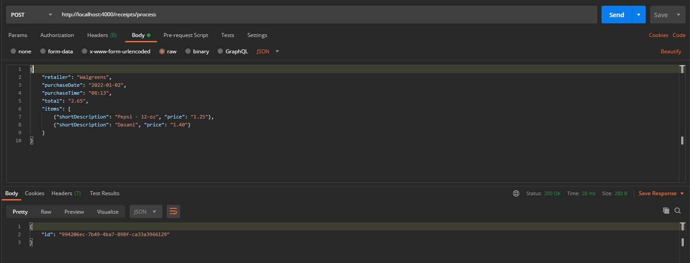
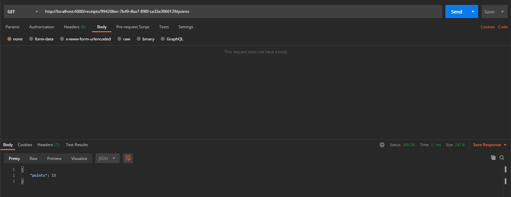

# Receipt Processor

This project implements a simple backend API for processing receipts as described [here](https://github.com/fetch-rewards/receipt-processor-challenge).

## Tech Stack

1. [Node.js](https://nodejs.org/en)
1. [TypeScript](https://www.typescriptlang.org/)
1. [Docker](https://www.docker.com/)

## Setup

### Using Docker Compose

If [Docker Compose](https://docs.docker.com/compose/) is installed, run the following commands from the project base directory:

#### Build and Run

```
docker-compose build
docker-compose up -d
```

#### Cleanup

```
docker-compose down
```

### Using Docker

Run the following commands from the project base directory:

#### Build and Run

```
docker build -t fetch_backend .
docker run -it -p 4000:4000 fetch_backend -d
```

#### Cleanup

> The container_id is the output from the run command above.

```
docker stop <container_id>
docker container rm <container_id>
```

## API Usage

The server is currently configured to be on http://localhost:4000.

### Process Receipts

- Path: `/receipts/process`
- Method: `POST`

#### Payload

Request payload is a JSON object of the following form:

```JSON
{
    "retailers": string,
    "purchaseDate": "[year]-[month]-[day]",
    "purchaseTime": "[hour]:[minute]", // 24 hour format
    "total": "[dollar].[cents]", // 2 decimal places,
    "item": [
        {"shortDescription": string, "price": "[dollar].[cents]"},
    ]
}
```

Example:

```JSON
{
    "retailer": "Walgreens",
    "purchaseDate": "2022-01-02",
    "purchaseTime": "08:13",
    "total": "2.65",
    "items": [
        {"shortDescription": "Pepsi - 12-oz", "price": "1.25"},
        {"shortDescription": "Dasani", "price": "1.40"}
    ]
}
```

#### Response

A successful request returns a JSON object of the following form:

```JSON
{
    "id": string
}
```

Example:

```JSON
{
    "id": "994206ec-7b49-4ba7-898f-ca33a3966129"
}
```

#### Example Request and Response



### Get Points

- Path: `/receipts/{id}/points`
- Method: `Get`

#### Response

A successful request returns a JSON object of the following form:

```JSON
{
    "points": number
}
```

Example:

```JSON
{
    "points": 15
}
```

#### Example Request and Response


